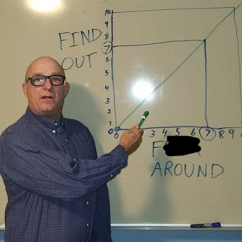

```{css,echo = F}
.small .remark-code { /*Change made here*/
  font-size: 85% !important;
}
.tiny .remark-code { /*Change made here*/
  font-size: 50% !important;
}
```

```{r,include=F}
set.seed(123)
options(width=60)
knitr::opts_chunk$set(fig.align='center',fig.width=9,fig.height=5,message=F,warning=F)
def.chunk.hook  <- knitr::knit_hooks$get("chunk")
knitr::knit_hooks$set(chunk = function(x, options) {
  x <- def.chunk.hook(x, options)
  ifelse(options$size != "normalsize", paste0("\n \\", options$size,"\n\n", x, "\n\n \\normalsize"), x)
})
```

---

# Today: Let's talk about regression

{#id .class width=60% height=70%}

---

# Can betting markets help us predict elections?

\pause

  - Data from an online betting company Intrade \pause
  - People trade contracts such as ``Obama to win the electoral votes in Florida'' \pause
  - Market prices of each contract fluctuate based on its sales \pause
  - Why might we expect betting markets like Intrade to accurately predict outcomes of elections? 

---

# Linear Regression: Prediction using bivariate relationships

\pause

  - Goal: what’s our best guess about $Y_i$ if we know what $X_i$ is? \pause
    - What’s our best guess about election margins if we know the market's margins? \pause
  - Terminology:
    - **Dependent/outcome variable**: what we want to predict (election margin). \pause
    - **Independent/explanatory variable**: what we’re using to predict (market margin).

---

# We'll use two datasets: `intrade08.csv` & `pres08.csv`

\footnotesize
| Name           | Description |
|----------------|:------------------------------------------------------------------------------------------|
| `day` |   Date of the session |
| `statename` | Full name of each state (including DC in 2008) | 
| `state` |  Abbreviation of each state (including DC in 2008) |
| `PriceD` | Closing price (predicted vote share) of Democratic Nominee's market |
| `PriceR` | Closing price (predicted vote share) of Republican Nominee's market  |
| `VolumeD` | Total session trades of Democratic Party Nominee's market |
| `VolumeR` |  Total session trades of Republican Party Nominee's market | 

  - `intrade08.csv`: Each row represents daily trading information about the contracts for either the Democratic or Republican Party nominee's victory in a particular state. 

---

# Presidential voting data from 2008

--------------------------------------------------------------------------------
 Name                 Description
 -------------------- ----------------------------------------------------------
 `state.name`         Full name of state (only in `pres2008`)
 
 `state`              Two letter state abbreviation
 
 `Obama`              Vote percentage for Obama
 
 `McCain`             Vote percentage for McCain
 
 `EV`                 Number of electoral college votes for this state
--------------------------------------------------------------------------------

---

# Predicting Elections Using Betting Markets and Linear Models

 \pause
 
  - Load the data
  
```{r, echo=FALSE}
setwd("~/Library/CloudStorage/Dropbox/Villanova/TEACHING/PSC4375 - QSS/PSC4375_S2025/PSC4375_S2025/lectures")
```
  
  
```{r}
library(tidyverse)
intrade08 <- read.csv("../data/intrade08.csv")
pres08 <- read.csv("../data/pres08.csv")

## merge datasets and calculate margins for DV and IV
intresults08 <- inner_join(intrade08,pres08) %>%
  mutate(obama.intmarg = PriceD - PriceR,
         obama.actmarg = Obama - McCain)
```

---

# Plot bivariate relationship
  
```{r, echo=FALSE, fig.width=4, fig.height=3}
intresults08 %>%
  group_by(state) %>%
  summarize(obama.intmarg = mean(obama.intmarg),
            obama.actmarg = mean(obama.actmarg)) %>%
  ggplot(aes(x=obama.intmarg,y=obama.actmarg)) +
  geom_point(shape = 21) + 
  # geom_smooth(method='lm') +
  labs(x = "Market's margin for Obama",
       y = "Obama margin") +
  theme_bw()
```
  
---

# Using a line to predict

 \pause
 
  - Prediction: for any value of $X$ , what’s the best guess about $Y$?  \pause
    - Need a function $y = f(x)$ that maps values of $X$ into predictions. \pause
    - **Machine learning**: fancy ways to determine $f(x)$ \pause
  - Simplest possible way to relate two variables: a line. \pause

$$  
y = mx + b
$$

 \pause
 
  - Problem: for any line we draw, not all the data is on the line. \pause
    - Some points will be above the line, some below. \pause
    - Need a way to account for **chance variation** away from the line.
    
---

# Linear Regression Model

  - Model for the line of best fit
  
$$
Y_i = \underbrace{\alpha}_{\textrm{intercept}} + \underbrace{\beta}_{\textrm{slope}} \times X_i + \underbrace{\epsilon_i}_{\textrm{error term}}
$$
 \pause
 
  - **Coefficients/parameters** $(\alpha,\beta)$: true unknown intercept/slope of the line of best fit \pause
  - **Chance error** $(\epsilon_i)$: accounts for the fact that the line doesn't perfectly fit the data. \pause
    - Each observation allowed to be off the regression line
    - Chance errors are 0 on average \pause
  - Useful fiction: this model represents the **data generating process**
    - George Box: "all models are wrong, some are useful" 
    
---

# Interpretting the Regression Line

$$
Y_i = \alpha + \beta \times X_i + \epsilon_i
$$

 \pause
 
  - **Intercept** $alpha$: average value of $Y$ when $X$ is 0 
    - Average Obama margin when market's margin is 0. \pause
  - **Slope** $\beta$: average change in $Y$ when $X$ increases by one unit
    - Average increase in Obama margin for each additional margin increase by the market.  \pause
  - But we don't know $\alpha$ or $\beta$. How can we estimate them? Next time...  \pause
    - Or now if we still have time!
    
---

# Linear Regression Model (skip if same day)

  - Model for the line of best fit
  
$$
Y_i = \underbrace{\alpha}_{\textrm{intercept}} + \underbrace{\beta}_{\textrm{slope}} \times X_i + \underbrace{\epsilon_i}_{\textrm{error term}}
$$

  - **Coefficients/parameters** $(\alpha,\beta)$: true unknown intercept/slope of the line of best fit
  - **Chance error** $(\epsilon_i)$: accounts for the fact that the line doesn't perfectly fit the data.
    - Each observation allowed to be off the regression line
    - Chance errors are 0 on average
  
---

# Estimate coefficients

 \pause
 
  - Parameters: $\alpha, \beta$ 
    - Unknown features of the data-generating process.
    - Chance error makes these impossible to observe directly. \pause
  - Estimates: $\hat{\alpha}, \hat{\beta}$
    - An estimate is our best guess about some parameter. \pause
  - Regression line:

$$
\hat{Y} = \hat{\alpha} + \hat{\beta} * x
$$

  - Average value of $Y$ when $X$ is $x$
  - Represents the best guess or **predicted value** of the outcome at $x$.  
    
---

# Line of best fit

```{r, echo=FALSE, fig.width=4, fig.height=3}
intresults08 %>%
    group_by(state) %>%
  summarize(obama.intmarg = mean(obama.intmarg),
            obama.actmarg = mean(obama.actmarg)) %>%
  ggplot(aes(x=obama.intmarg,y=obama.actmarg)) +
  geom_point(shape = 21) + 
  geom_smooth(method='lm', color="red", se=F) +
  labs(x = "Market's margin for Obama",
       y = "Obama margin") +
  theme_bw()
```

---

# Why not this line?

```{r, echo=FALSE, fig.width=4, fig.height=3}
intresults08 %>%
    group_by(state) %>%
  summarize(obama.intmarg = mean(obama.intmarg),
            obama.actmarg = mean(obama.actmarg)) %>%
  ggplot(aes(x=obama.intmarg,y=obama.actmarg)) +
  geom_point(shape = 21) + 
  geom_abline(intercept = -15, slope = 1, color="blue") +
  labs(x = "Market's margin for Obama",
       y = "Obama margin") +
  theme_bw()
```

---

# Least squares

 \pause
 
  - How do we figure out the best line to draw? \pause
    - **Fitted/predicted value** for each observation: $\hat{Y} = \hat{\alpha} + \hat{beta} \times X_i$ \pause
    - **Residual/prediction error**: $\hat{\epsilon_i} = Y_i - \hat{Y}$ \pause
    
  - Get these estimates by the **least squares method** \pause
  - Minimize the **sum of the squared residuals** (SSR): \pause
  
$$
SSR = \sum_{i=1}^{n} \hat{\epsilon}_i^2 = \sum_{i=1}^n (Y_i - \hat{\alpha} - \hat{\beta}X_i)^2
$$

 \pause
 
  - Finds the line that minimizes the magnitude of the prediction errors!
  
---

# Linear Regression in R

 \pause
 
  - R will calculate least squares line for a data set using `lm()` \pause
    - Syntax: `lm(y ~ x, data = mydata)` \pause
    - `y` is the name of the dependent variable
    - `x` is the name of the independent variable
    - `mydata` is the data.frame where they live

---     

# Linear Regression in R

\small 
```{r, warning=FALSE}
fit <- lm(obama.actmarg ~ obama.intmarg, data = intresults08)
fit
```

---

# Coefficients and fitted values

  - Use `coef()` to extract estimated coefficients:

```{r}
coef(fit)
```

  - R can show you each of the fitted values as well:
  
```{r}
head(fitted(fit))
```

---

# Properties of least squares

  - Least squares line always goes through $(\bar{X},\bar{Y})$
  - Estimated slope is related to correlation:
  
$$
\hat{\beta} = (\textrm{correlation of } X \textrm{and } Y) \times \frac{\textrm{SD of }Y}{\textrm{SD of }X}
$$

  - Mean of residuals is always 0
  
---

# Visual components of least squares

```{r, echo=FALSE, fig.width=4, fig.height=3}
intresults08 %>%
    group_by(state) %>%
  summarize(obama.intmarg = mean(obama.intmarg),
            obama.actmarg = mean(obama.actmarg)) %>%
  ggplot(aes(x=obama.intmarg,y=obama.actmarg)) +
  geom_point(shape = 21) + 
  geom_smooth(method='lm', color="red", se=F) +
  labs(x = "Market's margin for Obama",
       y = "Obama margin") +
  theme_bw()
```

---

# Visual components of least squares

```{r, echo=FALSE, fig.width=4, fig.height=3}
intresults08 %>%
    group_by(state) %>%
  summarize(obama.intmarg = mean(obama.intmarg),
            obama.actmarg = mean(obama.actmarg)) %>%
  ggplot(aes(x=obama.intmarg,y=obama.actmarg)) +
  geom_point(shape = 21) + 
  geom_smooth(method='lm', color="red", se=F) +
  geom_vline(xintercept=mean(intresults08$obama.intmarg), color="navyblue", linewidth=1) +
  geom_hline(yintercept=mean(intresults08$obama.actmarg), color="navyblue", linewidth=1) +
  labs(x = "Market's margin for Obama",
       y = "Obama margin") +
  theme_bw()
```

---

# Visual components of least squares

```{r, echo=FALSE, fig.width=4, fig.height=3}
intresults08 %>%
    group_by(state) %>%
  summarize(obama.intmarg = mean(obama.intmarg),
            obama.actmarg = mean(obama.actmarg)) %>%
  ggplot(aes(x=obama.intmarg,y=obama.actmarg)) +
  geom_point(shape = 21) + 
  geom_smooth(method='lm', color="red", se=F) +
  geom_vline(xintercept=0, color="orange", linewidth=1, linetype="dashed") +
  geom_vline(xintercept=mean(intresults08$obama.intmarg), color="navyblue", linewidth=1) +
  geom_hline(yintercept=mean(intresults08$obama.actmarg), color="navyblue", linewidth=1) +
  labs(x = "Market's margin for Obama",
       y = "Obama margin") +
  theme_bw()
```