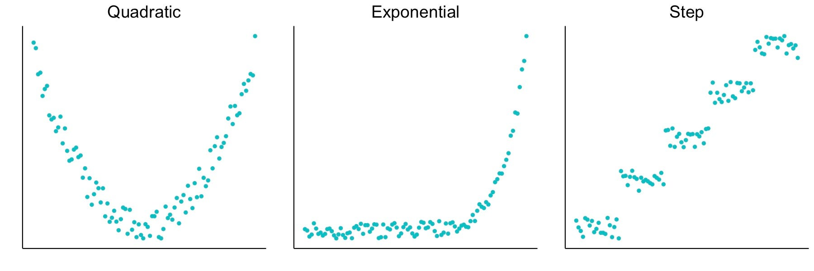

```{css,echo = F}
.small .remark-code { /*Change made here*/
  font-size: 85% !important;
}
.tiny .remark-code { /*Change made here*/
  font-size: 50% !important;
}
```

```{r,include=F}
set.seed(123)
options(width=60)
knitr::opts_chunk$set(fig.align='center',fig.width=9,fig.height=5,message=F,warning=F)
def.chunk.hook  <- knitr::knit_hooks$get("chunk")
knitr::knit_hooks$set(chunk = function(x, options) {
  x <- def.chunk.hook(x, options)
  ifelse(options$size != "normalsize", paste0("\n \\", options$size,"\n\n", x, "\n\n \\normalsize"), x)
})
```


---

# Week 9

\begin{itemize}
  \item QSS Tidyverse Tutorial 7 due Thursday \pause
  \item Midterm: Discuss Wednesday \pause
  \item Final project proposals: feedback this week \pause
  \item M/W: Finish up last week \pause
  \item W/F: Maaaaaaybe get caught up; if not, we'll finish this week's material next Monday \pause
  \item F: posting problem set 3
\end{itemize}

```{r,echo=F}
library(tidyverse)
```

---

# Interactions with Continuous Variables

 \pause
 
  - Continuing with the Michigan **social pressure get-out-the-vote experiment**
  - Create an age variable:

```{r}
data(social, package="qss")
social <- social %>%
  mutate(age = 2006 - yearofbirth)
summary(social$age)
```

---

# Hetergeneous effects

 \pause
 
  - From before: \pause
    - Effect of the Neighbors mailer differ from previous voters vs. nonvoters? \pause
    - Used an interaction term to assess **effect heterogeneity** between groups \pause
  - How does the effect of the Neighbors mailer vary by age? \pause
    - Not just two groups, but a continuum of possible age values \pause
  - Remarkable, the same **interaction term** will work here too!
  
$$
Y_i = \alpha + \beta_1\text{age}_i + \beta_2 \text{neighbors}_i + \beta_3 (\text{age}_i \times \text{neighbors}_i) + \varepsilon_i
$$

---

# Predicted values from non-interacted model

 \pause  
 
  - Let $X_i =$ age$_i$ and $Z_i =$ neighbors$_i$
  
$$
\hat{Y}_i = \hat{\alpha} + \hat{\beta}_1 X_i + \hat{\beta}_2 Z_i 
$$

\pause

\begin{center}
\begin{tabular}{ r | l  l }
 & Control ($Z_i = 0$) & Neighbors ($Z_i = 1$) \\
\hline
25 year-old ($X_i = 25$)  & \only<4-9>{$\hat{\alpha} + \hat{\beta}_1 25$} &  \only<5-9>{$\hat{\alpha} + \hat{\beta}_1 25 + \hat{\beta}_2$} \\
26 year-old ($X_i = 26$) & \only<6-9>{$\hat{\alpha} + \hat{\beta}_1 26$} &  \only<7-9>{$\hat{\alpha} + \hat{\beta}_1 26 + \hat{\beta}_2$} \\
\end{tabular}
\end{center} 

\pause 

\begin{itemize}
\only<8->{\item Effect of Neighbors for a 25 year-old:} 
\end{itemize}\vspace{-5pt}

$$
\only<8->{(\hat{\alpha} + \hat{\beta}_1 25 + \hat{\beta}_2) - (\hat{\alpha} + \hat{\beta}_1 25) = \hat{\beta}_2}
$$
\pause \vspace{-5pt}

\begin{itemize}
\only<9->{\item Effect of Neighbors for a 26 year-old:} 
\end{itemize}\vspace{-5pt}

$$
\only<9->{(\hat{\alpha} + \hat{\beta}_1 26 + \hat{\beta}_2) - (\hat{\alpha} + \hat{\beta}_1 26) = \hat{\beta}_2}
$$

---

# Visualizing the regression

```{r, echo=F,fig.width=4, fig.height=3}
social.neighbor <- social %>%
  filter(messages %in% c("Control","Neighbors")) %>%
  group_by(messages,age) %>%
  summarize(primary2006 = mean(primary2006)) %>%
  mutate(neighbors = ifelse(messages=="Neighbors",1,
                            ifelse(messages=="Control",0,NA)))
  

social %>%
  ggplot() +
  geom_smooth(data = social %>% filter(messages=="Control"), aes(x=age, y=primary2006), method="lm", se=F, color="blue") +
  annotate("text", 
           x = 40, y = 0.2, 
           label = "Control", 
           color = "blue", 
           size = 4) +
  labs(x = "Age", y = "Predicted Turnout Rate") +
  theme_bw()
```

---

# Visualizing the regression

```{r, echo=F,fig.width=4, fig.height=3}
social %>%
  ggplot() +
  geom_smooth(data = social %>% filter(messages=="Control"), aes(x=age, y=primary2006), method="lm", se=F, color="blue") +
  annotate("text", 
           x = 40, y = 0.2, 
           label = "Control", 
           color = "blue", 
           size = 4) +
  geom_smooth(data = social %>% filter(messages=="Neighbors"), aes(x=age, y=primary2006), method="lm", se=F, color="red") +
  annotate("text", 
           x = 40, y = 0.4, 
           label = "Control", 
           color = "red", 
           size = 4) +
  labs(x = "Age", y = "Predicted Turnout Rate") +
  theme_bw()

```


---

# Visualizing the regression

```{r, echo=F,fig.width=4, fig.height=3}
social %>%
  ggplot() +
  geom_smooth(data = social %>% filter(messages=="Control"), aes(x=age, y=primary2006), method="lm", se=F, color="blue") +
  annotate("text", x = 40, y = 0.2, label = "Control", color = "blue", size = 4) +
  geom_smooth(data = social %>% filter(messages=="Neighbors"), aes(x=age, y=primary2006), method="lm", se=F, color="red") +
  annotate("text", 
           x = 40, y = 0.4, 
           label = "Control", 
           color = "red", 
           size = 4) +
  annotate("segment", x = 40, y = 0.26, xend = 40, yend = 0.33, 
           arrow = arrow(type = "closed", length = unit(0.1, "inches")), 
           size = .4, color = "black") +
  annotate("text", x = 43, y = 0.31, 
           label = expression(hat(beta)), 
           color = "black", size = 3) +
  labs(x = "Age", y = "Predicted Turnout Rate") +
  theme_bw()

```

---

# Predicted values from interacted model

$$
\hat{Y}_i = \hat{\alpha} + \hat{\beta}_1 X_i + \hat{\beta}_2 Z_i + \hat{\beta}_3  X_i Z_i
$$

\begin{center}
\begin{tabular}{ r | l  l }
 & Control ($Z_i = 0$) & Neighbors ($Z_i = 1$) \\
\hline
25 year-old ($X_i = 25$)  & $\hat{\alpha} + \hat{\beta}_1 25$ &  $\hat{\alpha} + \hat{\beta}_1 25 + \hat{\beta}_2\ + \hat{\beta}_3 25$ \\
26 year-old ($X_i = 26$) & $\hat{\alpha} + \hat{\beta}_1 26$ &  $\hat{\alpha} + \hat{\beta}_1 26 + \hat{\beta}_2 + \hat{\beta}_2\ + \hat{\beta}_3 26$ \\
\end{tabular}
\end{center} 

  - Effect of Neighbors for a 25 year-old: \vspace{-10pt}

$$
(\hat{\alpha} + \hat{\beta}_1 25 + \hat{\beta}_2 + \hat{\beta}_3 25) - (\hat{\alpha} + \hat{\beta}_1 25) = \hat{\beta}_2 + \hat{\beta}_3 25)
$$


  - Effect of Neighbors for a 26 year-old: \vspace{-10pt}

$$
(\hat{\alpha} + \hat{\beta}_1 26 + \hat{\beta}_2 + \hat{\beta}_3 26) - (\hat{\alpha} + \hat{\beta}_1 26) = \hat{\beta}_2 + \hat{\beta}_3 26)
$$

  - Effect of Neighbors for a $x$ year-old: \vspace{-10pt}
 
$$
\hat{\beta}_2 + \hat{\beta}_3 x
$$ 

---

# Visualizing the interaction

```{r, echo=F,fig.width=4, fig.height=3}
social %>%
  ggplot() +
  geom_smooth(data = social %>% filter(messages=="Control"), aes(x=age, y=primary2006), method="lm", se=F, color="blue") +
  annotate("text", x = 40, y = 0.2, label = "Control", color = "blue", size = 4) +
  geom_smooth(data = social %>% filter(messages=="Neighbors"), aes(x=age, y=primary2006), method="lm", se=F, color="red") +
  annotate("text", 
           x = 40, y = 0.4, 
           label = "Control", 
           color = "red", 
           size = 4) +
  annotate("segment", x = 40, y = 0.26, xend = 40, yend = 0.33, 
           arrow = arrow(type = "closed", length = unit(0.1, "inches")), 
           size = .4, color = "black") +
  annotate("text", x = 49, y = 0.33, 
           label = expression(hat(beta)[2] ~ "+" ~  hat(beta)[3] ~ "40"), 
           color = "black", size = 3) +
  annotate("segment", x = 80, y = 0.42, xend = 80, yend = 0.515, 
           arrow = arrow(type = "closed", length = unit(0.1, "inches")), 
           size = .4, color = "black") +
  annotate("text", x = 89, y = 0.5, 
           label = expression(hat(beta)[2] ~ "+" ~ hat(beta)[3] ~ "80"), 
           color = "black", size = 3) +
  labs(x = "Age", y = "Predicted Turnout Rate") +
  theme_bw()
```

---

# Interpretting coefficients

$$
Y_i = \alpha + \beta_1\text{age}_i + \beta_2 \text{neighbors}_i + \beta_3 (\text{age}_i \times \text{neighbors}_i)
$$

  - $\hat{\alpha}$: average turnout for 0 year-olds in the control group.
  - $\hat{\beta}_1$: slope of regression line for age in the control group.
  - $\hat{\beta}_2$: average effect of Neighbors mailer for 0 year-olds.
  - $\hat{\beta}_3$: change in the **effect** of the Neighbors mailer for a 1-year $\uparrow$ in age.
    - Effect for $x$ year-olds: $\hat{\beta}_2 + \hat{\beta}_3 x$
    - Effect for $(x+1)$ year-olds: $\hat{\beta}_2 + \hat{\beta}_3 (x+1)$
    - Change in effect: $\hat{\beta}_3$
    
---

# Interactions in R

  - You can use the `:` way to create interaction terms like last time:

```{r}
int.fit <- lm(primary2006 ~ age + neighbors + age:neighbors, data = social.neighbor)
coef(int.fit)
```

  - Or you can use the `var1 * var2` shortcut, which will add both variable and their interaction:

```{r}
int.fit2 <- lm(primary2006 ~ age*neighbors, data = social.neighbor)
coef(int.fit2)
```

---

# General interpretation of interactions

$$
\hat{Y}_i = \hat{\alpha} + \hat{\beta}_1 X_i + \hat{\beta}_2 Z_i + \hat{\beta}_3  X_i Z_i
$$

- $\hat{\alpha}$: average turnout when $X_i$ and $Z_i$ are $0$.
  - $\hat{\beta}_1$: average change in $Y_i$ of a one-unit change in $X_i$ when $Z_i = 0$.
  - $\hat{\beta}_2$: average change in $Y_i$ of a one-unit change in $Z_i$ when $X_i = 0$.
  - $\hat{\beta}_3$: has two equivalent interpretations:
    - Change in the effect/slope of $X_i$ for a one-unit change in $Z_i$
    - Change in the effect/slope of $Z_i$ for a one-unit change in $X_i$
  
---

# Nonlinear relationships



---

# Linear regression are linear

$$
\hat{Y}_i = \hat{\alpha} + \hat{\beta}_1 X_i
$$

  - Standard linear regression can only pick up **linear** relationships.
  - What if the relationship between $X_i$ and $Y_i$ is nonlinear?
  
---

# Adding a squared term

  - To allow for nonlinearity in age, add a squared term to the model
  
$$
\hat{Y}_i = \hat{\alpha} + \hat{\beta}_1 \text{age}_i + \hat{\beta}_2 \text{age}_i^2
$$  

  - We are now fitting a **parabola** to the data.
  - In R, we need to wrap the squared term in `I()`:
  
```{r}
fit.sq <- lm(primary2006 ~ age + I(age^2), data = social)
coef(fit.sq)
```

  - $\hat{\beta}_2$: how the effect of age increases as age increases
  
---

# Predicted values from lm()

\small 
  - We can get predicted values out of R using the `predict()` function:

```{r}
predict(fit.sq, newdata = list(age = c(20, 21, 22)))
```

  - Create a vector of ages to predict and save predictions:

\small   
```{r}
age.vals <- 20:85
age.preds <- predict(fit.sq, newdata = list(age = age.vals))
age.plot <- tibble(age.vals,age.preds)
```
  
  - Plot the predictions:

\small   
```{r, fig.show='hide'}
ggplot(age.plot,aes(x = age.vals, y = age.preds)) +
  geom_point(color = "blue", size = 3, shape = 1) + ylim(0.1, 0.55) +
  labs(x = "Age", y = "Predicted Turnout Rate") + theme_bw()
```

---

# Plotting predicted values

```{r, echo=F,fig.width=4, fig.height=3}
ggplot(age.plot,aes(x = age.vals, y = age.preds)) +
  geom_point(color = "blue", size = 3, shape = 1) +
  ylim(0.1, 0.55) +
  labs(x = "Age", y = "Predicted Turnout Rate") +
  theme_bw()
```

---

# Plotting lines instead of points:

  - If you want to connect the dots in your scatterplot, you can use `geom_line()`:
  
```{r, fig.show='hide'}
ggplot(age.plot, aes(x = age.vals, y = age.preds)) +
  geom_line(color = "blue", size = 1.5) +
  ylim(0.1, 0.55) +
  labs(x = "Age", y = "Predicted Turnout Rate") +
  theme_bw()
```

---

# Plotting predicted values

  - If you want to connect the dots in your scatterplot, you can use `geom_line()`:
  
```{r, echo=F,fig.width=4, fig.height=3}
ggplot(age.plot, aes(x = age.vals, y = age.preds)) +
  geom_line(color = "blue", size = 1.5) +
  ylim(0.1, 0.55) +
  labs(x = "Age", y = "Predicted Turnout Rate") +
  theme_bw()
```

---

# Comparing to linear fit

  - If you want to connect the dots in your scatterplot, you can use `geom_line()`:
  
```{r, echo=F,fig.width=4, fig.height=3}
ggplot(age.plot, aes(x = age.vals, y = age.preds)) +
  geom_line(color = "blue", size = 1.5) +
  geom_smooth(method="lm", se=F, color="red") +
  ylim(0.1, 0.55) +
  labs(x = "Age", y = "Predicted Turnout Rate") +
  theme_bw()
```

---

# Diagnosing nonlinearity

  - One independent variable: just look at a scatterplot.
  - With multiple independent variables, harder to diagnose.
  - One useful tool: scatterplot of residuals versus independent variables.
  - Example: let's talk about walking and health

```{r,echo=F}
setwd("~/Library/CloudStorage/Dropbox/Villanova/TEACHING/PSC7475 - QSS/PSC7475_S2025/PSC7475_S2025/lectures")
library(tidyverse)
```
  
```{r}
health <- read.csv("../data/health.csv")

w.fit <- lm(weight ~  steps.lag + dayofyear, data = health)
```

---

# Residual plot

```{r,echo=F, fig.width=7, fig.height=4}
library(patchwork)

plot1 <- ggplot(health, aes(x = steps.lag, y = residuals(w.fit))) +
  geom_point(shape=1) +
  labs(x = "Lagged Steps", y = "Residuals") +
  theme_bw()

plot2 <- ggplot(health, aes(x = dayofyear, y = residuals(w.fit))) +
  geom_point(shape=1) +
  labs(x = "Day of the year (out of 365)", y = "Residuals") +
  theme_bw()

plot1 + plot2
```

---

# Add a squared term for a better fit

```{r}
w.fit.sq <- lm(weight ~ steps.lag + dayofyear + I(dayofyear^2), data = health)
coef(w.fit.sq)
```

---

# Residual plot, redux

```{r,echo=F, fig.width=7, fig.height=4}
library(patchwork)

plot3 <- ggplot(health, aes(x = steps.lag, y = residuals(w.fit.sq))) +
  geom_point(shape=1) +
  labs(x = "Lagged Steps", y = "Residuals") +
  theme_bw()

plot4 <- ggplot(health, aes(x = dayofyear, y = residuals(w.fit.sq))) +
  geom_point(shape=1) +
  labs(x = "Day of the year (out of 365)", y = "Residuals") +
  theme_bw()

plot3 + plot4
```

